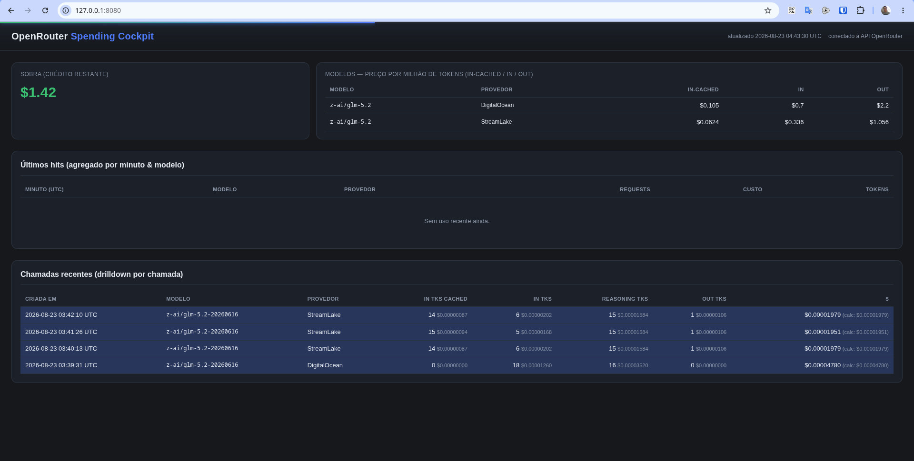

# OpenRouterSpendingCockpit

<p align="center">
  
</p>

Dashboard **web local** para acompanhar em tempo real o gasto no OpenRouter durante o uso de agentes (kilocode e outros). Mostra saldo de créditos, uso agregado por minuto + modelo e drilldown por chamada individual, com custo estimado por operação.

## Recursos

- **Saldo de créditos** — comprado / usado / restante (`GET /credits`).
- **Uso por minuto + modelo** — requests, custo e tokens agregados dos últimos minutos.
- **Drilldown por chamada** — cada geração com tokens (prompt / cached / reasoning / completion) e o custo estimado de cada coluna.
- **Preços por modelo** — tabela com preço por token (in / in-cached / out) dos modelos realmente usados.
- **Tempo real** — atualização via SSE, sem recarregar a página.
- **Zero dependências** — binário único, Go stdlib only, UI embutida via `//go:embed`.

## Como executar

### 1. Crie uma management key (pré-requisito)

Necessária para `/analytics/*`, `/credits` e `/generation`:

1. Acesse https://openrouter.ai/settings/keys
2. Crie uma **management key**.
3. **Cuidado:** a management key tem poder elevado — não commitar nem expor.

### 2. Obtenha o binário

**Opção A — binário pronto (sem Go instalado):** baixe o arquivo do seu SO/arquitetura em
https://github.com/ifloor/OpenRouterSpendingCockpit/releases
(e.g. `openrouter-spending-cockpit-1.0.0-linux-amd64`) e dê `chmod +x`.

**Opção B — build a partir do source:** veja a seção [Build](#build-a-partir-do-source).

### 3. Rode

O nome do binário da release é `openrouter-spending-cockpit-<versão>-<os>-<arch>`
(ex.: `openrouter-spending-cockpit-1.0.0-linux-amd64`; ajuste o sufixo para o seu
SO/arquitetura). Rodar:

```sh
# via env
OPENROUTER_MANAGEMENT_KEY=sk-or-... ./openrouter-spending-cockpit-1.0.0-linux-amd64 -port 8080 -interval 5s -v

# ou via flag
./openrouter-spending-cockpit-1.0.0-linux-amd64 -api-key sk-or-... -port 8080 -interval 5s
```

Abra **http://127.0.0.1:8080** no navegador. As tabelas começam a encher após o
primeiro uso real do agente (o analytics do OpenRouter tem eventual consistency —
chamadas recentes aparecem com atraso de ~30s a 2min).

### Flags

| Flag | Default | Descrição |
|------|---------|-----------|
| `-api-key` | env `OPENROUTER_MANAGEMENT_KEY` | Chave de gerenciamento (nunca logada completa; mascarada). |
| `-port` | `8080` | Porta HTTP local. |
| `-interval` | `5s` | Intervalo de polling (teste com `2s` ou `60s`). |
| `-v` | off | Logs verbosos do collector. |

## Build a partir do source

Requisito: **Go 1.26+** (`go version`). O projeto não tem dependências externas —
nada a baixar além do próprio código.

```sh
git clone https://github.com/ifloor/OpenRouterSpendingCockpit.git
cd OpenRouterSpendingCockpit

go build -o openrouter-spending-cockpit .
./openrouter-spending-cockpit -api-key sk-or-...
```

Comandos úteis de desenvolvimento:

```sh
go build -o openrouter-spending-cockpit .   # compila o binário (UI embutida via //go:embed)
go test ./...                               # testes unitários + integração (httptest, sem rede real)
go vet ./...                                # verificação estática
```

## Como funciona

- **Coleta por tick** (a cada `-interval`): `GET /credits` (saldo) → `POST /analytics/query`
  agregado (dims `model` + `provider`, granularidade `minute`) → `POST /analytics/query`
  drilldown (dim `generation_id`) → enriquecimento de novos IDs via `GET /generation`
  (máx. 5/tick, com dedup).
- **No boot**, chama `GET /analytics/meta` para enumerar `metrics`/`dimensions`/
  `granularities`/`operators` reais e usa exatamente esses nomes (não assume).
- **Preços**: `GET /models` (público) é carregado preguiçosamente na 1ª vez que um
  modelo é visto em uso; o custo por geração é calculado localmente
  (prompt − cached, cached, reasoning, completion).
- **Estado só em memória** — reiniciar zera o histórico (cap de ~500 buckets e ~200
  gerações).
- **Página servida pelo próprio binário** (embutida via `//go:embed`), com snapshot
  JSON em `/api/state` e atualização via SSE em `/api/stream`.

## Limitações conhecidas

- **Drilldown não é tempo real por chamada:** `generation_id` (analytics) e `/generation`
  são eventualmente consistentes; chamadas recentes aparecem com atraso de ~30s–2min.
  Janela máxima de **31 dias** para a dimensão `generation_id`.
- **Custo de enriquecimento:** cada chamada nova gera um `GET /generation`; limitado por
  tick (máx. 5 IDs/tick) e dedup por ID para evitar rajadas/rate limit (429 → backoff no
  próximo tick).
- **`metadata.truncated`:** em volume alto a resposta pode ser parcial — a UI avisa e os
  totais não devem ser lidos como absolutos.
- **Atraso de propagação:** analytics eventualmente consistente; o `request_count`/`cost`
  do minuto corrente é parcial até o minuto fechar.
- **Requer management key**, que não é a chave normal de billing/uso.
- **Histórico volátil** (somente memória; cap de buckets e de gerações).

## Estrutura do projeto

```
main.go                          flags, wiring, HTTP server local (SSE + embed)
internal/openrouter/client.go    cliente REST (auth Bearer, erros HTTP, chave mascarada)
internal/openrouter/analytics.go GET /analytics/meta + POST /analytics/query (parse defensivo)
internal/openrouter/generation.go GET /generation + parse de tempo
internal/openrouter/credits.go   GET /credits
internal/openrouter/pricing.go   GET /models → catálogo de preços por slug + aliases
internal/collector/collector.go  goroutine ticker: descobre meta, polla, enriquece
internal/store/store.go          estado em memória (mutex), diffs por (minuto,modelo)
web/                             index.html, app.js, style.css (embutidos no binário)
img/sample.png                   screenshot do dashboard
```

## Release / CI

A cada push para `main`, o GitHub Actions (`.github/workflows/release.yml`) lê o
ficheiro `VERSION` na raiz do repo, gera binários estáticos (sem dependências) e
cria uma **GitHub Release** pública com a tag `v<version>`:

- Linux: `amd64`, `arm64`
- macOS: `amd64` (Intel), `arm64` (Apple Silicon)
- Windows: `amd64`

Para fazer um novo release, basta editar o `VERSION` (ex.: `1.0.0` → `1.0.1`) e
fazer push — a release é criada automaticamente em
https://github.com/ifloor/OpenRouterSpendingCockpit/releases.

Se a release da versão já existir, o workflow faz *skip* (para forçar a recriação,
correr o workflow manualmente com `force=true`).
